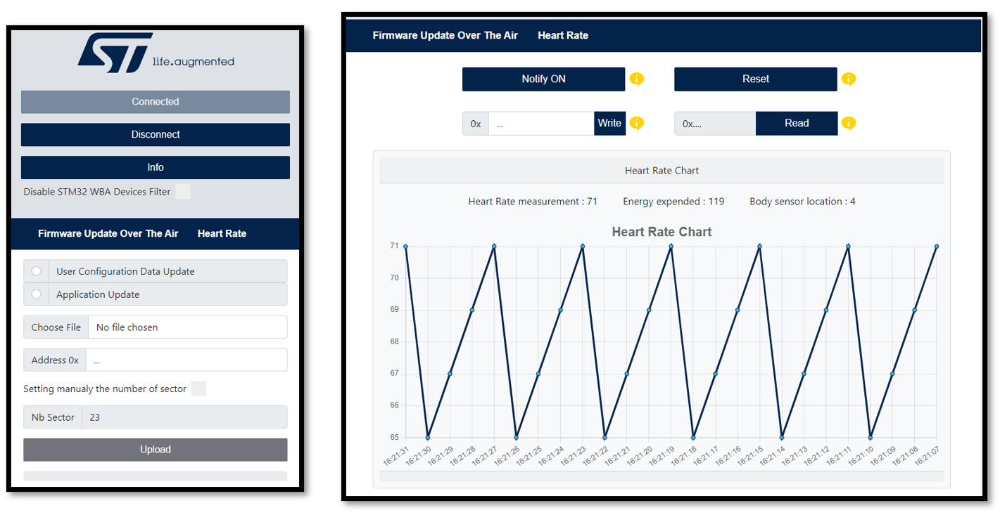
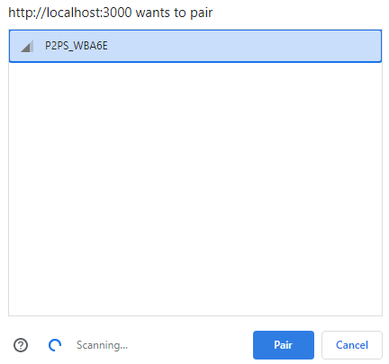
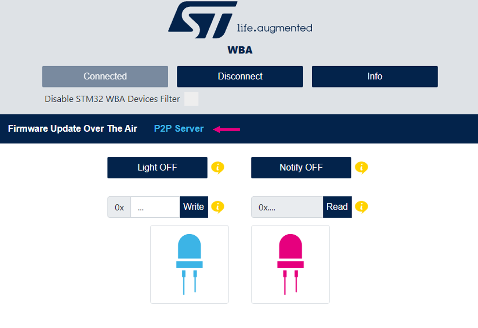
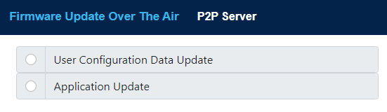
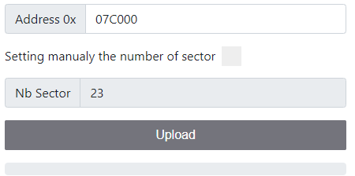
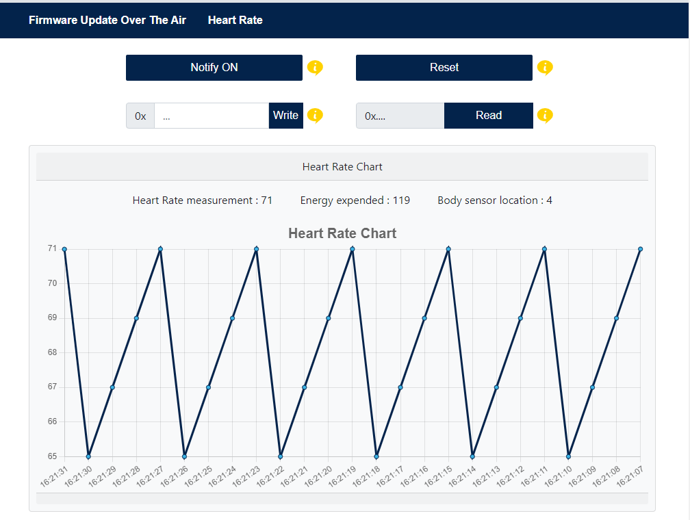
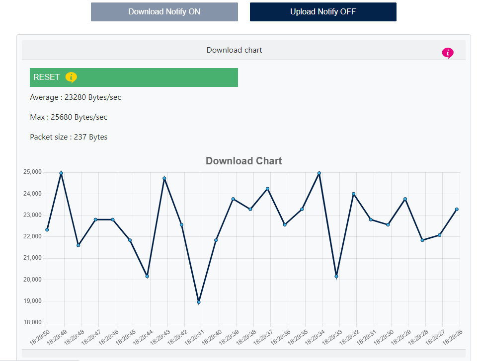
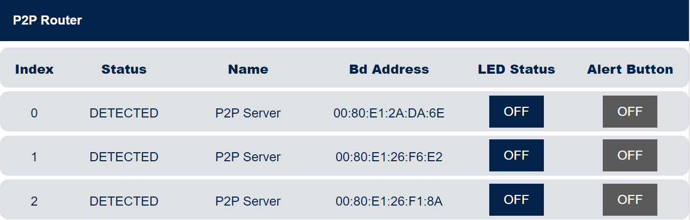
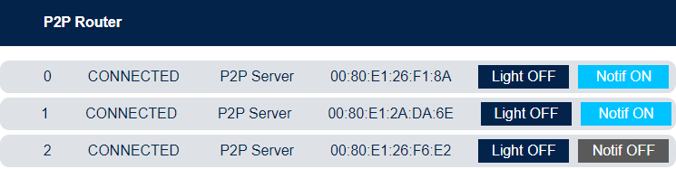
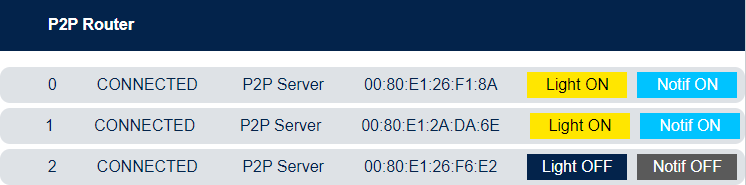

# **STM32WBA Web Bluetooth App Interfaces**

# **Introduction**

This is a web interface created with [React 18](https://reactjs.org/ "https://reactjs.org/") and [Bootstrap 5](https://getbootstrap.com/ "https://getbootstrap.com/").  
This web interface using Web Bluetooth® APIs can be used to establish a Bluetooth® LE connection and exchange data with a STM32WBA board

STM32WBA firmware applications that could be downloaded to interact with this Web Bluetooth application:  

-	[P2Pserver](https://wiki.st.com/stm32mcu/wiki/Connectivity:STM32WBA_Peer_To_Peer "https://wiki.st.com/stm32mcu/wiki/Connectivity:STM32WBA_Peer_To_Peer")
-	[HeartRate](https://wiki.st.com/stm32mcu/wiki/Connectivity:STM32WBA_HeartRate "https://wiki.st.com/stm32mcu/wiki/Connectivity:STM32WBA_HeartRate")
-	[Firmware Update Over The Air](https://wiki.st.com/stm32mcu/wiki/Connectivity:STM32WBA_FUOTA "https://wiki.st.com/stm32mcu/wiki/Connectivity:STM32WBA_FUOTA")
-	[Data Throughput](https://wiki.st.com/stm32mcu/wiki/Connectivity:STM32WBA_Data_Throughput "https://wiki.st.com/stm32mcu/wiki/Connectivity:STM32WBA_Data_Throughput")
-   [P2Prouter](https://wiki.st.com/stm32mcu/wiki/Connectivity:STM32WBA_Peer_To_Peer "https://wiki.st.com/stm32mcu/wiki/Connectivity:STM32WBA_Peer_To_Peer")

Example of the interface when a connection is established with Firmware Update Over The Air application and HeartRate application

***

# **Setup**

The following [wiki page]() will help you to put in place the hardware setup.

## Hardware requirements

To use the web interface, the following **STM32WBA** board is necessary .
- [NUCLEO-WBA52]()

A PC or a smartphone is required to open the web interface in a browser.

## Software requirements

For more information about STM32CubeWBA Software Architecture click [here](https://wiki.st.com/stm32mcu/wiki/Connectivity:STM32CubeWBA_SW_Architecture "https://wiki.st.com/stm32mcu/wiki/Connectivity:STM32CubeWBA_SW_Architecture")

All available binaries files are available [here]().  
Refer to [UM2237](https://wiki.st.com/stm32mcu/wiki/STM32CubeProg_introduction "https://wiki.st.com/stm32mcu/wiki/STM32CubeProg_introduction") to learn how to install and use STM32CubeProgrammer.  

For more information about Bluetooth® LE please refer to the [STMicroelectronics BLE Wiki](https://wiki.st.com/stm32mcu/wiki/Connectivity:BLE_overview "https://wiki.st.com/stm32mcu/wiki/Connectivity:BLE_overview").

***

# **User's guide**

## **P2Pserver**  

The P2Pserver application demonstrates a bidirectional BLE communication between a client and a server. The P2Pserver interface proposes a set of buttons to interact with the connected device. A reboot panel is available only if a P2Pserver service with the reboot OTA characteristic is detected on the device (see the Firmware Update Over The Air section to have more information related to OTA).  

### **Requierements**

Example with the [NUCLEO-WBA52]() board.  

[This](https://github.com/STMicroelectronics/STM32CubeWB/tree/master/Projects/P-NUCLEO-WB55.Nucleo/Applications/BLE/BLE_p2pServer/Binary "https://github.com/STMicroelectronics/STM32CubeWB/tree/master/Projects/P-NUCLEO-WB55.Nucleo/Applications/BLE/BLE_p2pServer/Binary") binary file has to be flashed in the microcontroller.  

### **Follow the next steps to learn how to use the application P2Pserver**

**Step 1.** Power on the STM32WBA board with the P2Pserver application flashed in and activate the bluetooth® on your machine.   
**Step 2.** Open [this](https://applible.github.io/Web_Bluetooth_App_WBA "https://applible.github.io/Web_Bluetooth_App_WBA") web page in your browser.  
**Step 3.** Click on the connect button then select P2PS_WBAxx in the device list and click pair.   
  
  
**Step 4.** Click on P2Pserver to show the interface and **don't hesitate to read the tooltips**.  
*Your are now connected.*  
*You can now interact with the connected device.*  
  

For more information about this application, please refer to [STM32 P2P Server](https://wiki.st.com/stm32mcu/wiki/Connectivity:STM32WBA_Peer_To_Peer "https://wiki.st.com/stm32mcu/wiki/Connectivity:STM32WBA_Peer_To_Peer").

***

## **Firmware Update Over The Air (OTA)**

The Firmware Update Over The Air (OTA) application allows a remote device to update the current application. 

### **Requierements**

Example with the [NUCLEO-WBA52]() board.  

The [BLE_ApplicationInstallManager]() application, associated to a BLE application embedding OTA service, manages the firmware update over the air of a BLE application.

The BLE_ApplicationInstallManager application must run with BLE applications embedding OTA service like: [BLE_HeartRate_ota]() or [BLE_p2pServer_ota]() applications.

BLE_ApplicationInstallManager is loaded at the memory address *0x08000000*.
BLE_HeartRate_ota or BLE_p2pServer_ota application is loaded at the memory address *0x08004000*.

### **Follow the next steps to learn how to use the application Firmware Update Over The Air.**  
**Step 1.** Power on the STM32WBA board with the Ota application flashed in and activate the bluetooth® on your machine.   
**Step 2.** Open [this](https://applible.github.io/Web_Bluetooth_App_WBA "https://applible.github.io/Web_Bluetooth_App") web page in your browser.  
**Step 3.** Click on the connect button then select your device list and click pair.  
*You are now connected*  
**Step 4.** Choose between updating the User Configuration Data and the Application.  
  
**Step 5.** Select the binary to be downloaded.

 
**Step 6. (Not mandatory)** Choose the first sector address from which the file will be write.  
**Step 7.** Click on the upload button and wait for the disconnection.  
  
*Congratulations, the new Application/Wireless stack is running and can be connected*  

For more information about this application, please refer to [STM32 FUOTA](https://wiki.st.com/stm32mcu/wiki/Connectivity:STM32WBA_FUOTA "https://wiki.st.com/stm32mcu/wiki/Connectivity:STM32WBA_FUOTA").

***

## **HeartRate**

The HeartRate application measures heart rate data and other information like the body sensor location and the energy expended. The HeartRate interface proposes a set of buttons and text input to interact with the connected device and a chart displaying the heart rate data received. A reboot panel is available only if a HeartRate service with the reboot OTA characteristic is detected on the device (see the Firmware Update Over The Air section to have more information related to OTA).  

### **Requierements**

Example with the [NUCLEO-WBA52]() board.  

[This]() binary file has to be flashed in the microcontroller.  

### **Follow the next steps to learn how to use the application HeartRate**

**Step 1.** Power on the STM32WBA board with the HeartRate application flashed in and activate the bluetooth® on your machine.   
**Step 2.** Open [this](https://applible.github.io/Web_Bluetooth_App_WBA "https://applible.github.io/Web_Bluetooth_App_WBA") web page in your browser.  
**Step 3.** Click on the connect button then select HRSTM in the device list and click pair.  
*You are now connected*  
**Step 4.** Click on HeartRate to show the interface and **don't hesitate to read the tooltips**.  
*You can now interact with the connected device.*  
  

For more information about this application, please refer to [STM32 Heart Rate](https://wiki.st.com/stm32mcu/wiki/Connectivity:STM32WBA_HeartRate#Software_and_system_requirements "https://wiki.st.com/stm32mcu/wiki/Connectivity:STM32WBA_HeartRate#Software_and_system_requirements").

***

## **Data Throughput**

The Data Throughput application measures the upload (data transfer from web interface to the connected device) and download (data transfer from the connected device to the web interface) throughput between the web app and the connected device. The Data Throughput interface proposes two panels, one to display the uploaded data and the other the downloaded data. Each panel has a chart of the data throughput and a button to reset the chart, the upload panel has also a button to start or stop the uploading of data.  

### **Requierements**

Example with the [NUCLEO-WBA52]() board.  

[This]() binary file has to be flashed in the microcontroller.  

### **Follow the next steps to learn how to use the application Data Throughput**

**Step 1.** Power on the STM32WBA board with the Data Throughput application flashed in and activate the bluetooth® on your machine.   
**Step 2.** Open [this](https://applible.github.io/Web_Bluetooth_App_WBA/ "https://applible.github.io/Web_Bluetooth_App_WBA") web page in your browser.  
**Step 3.** Click on the connect button then select DT_SERVER in the device list and click pair.  
*You are now connected*  
**Step 4.** Click on Data Throughput to show the interface and **don't hesitate to read the tooltips**.  
*You can now interact with the connected device.*  
  

For more information about this application, please refer to [STM32 Data Throughput](https://wiki.st.com/stm32mcu/wiki/Connectivity:STM32WBA_Data_Throughput "https://wiki.st.com/stm32mcu/wiki/Connectivity:STM32WBA_Data_Throughput").

***
## **P2P Router**

The P2Prouter application demonstrates STM32WBA acting at the same time as both: BLE central and peripheral, GATT server and client.

P2Prouter application scans to connect to P2Pserver devices and accept connection of ST Web Bluetooth app. It will route BLE messages received from both side.

### **Requierements**

Example with one [NUCLEO-WBA52]() board as a P2Prouter, two [NUCLEO-WBA52]()  and one [P-NUCLEO-WB55](https://www.st.com/en/evaluation-tools/p-nucleo-wb55.html "https://www.st.com/en/evaluation-tools/p-nucleo-wb55.html") boards as P2Pserver.  

You need a P2Prouter running on a STM32WBA52 and at least another STM32WBAxx / STM32WB Nucleo board to run a p2pServer application.

### **Follow the next steps to learn how to use the application P2Prouter**

**Step 1.** Power the board with the p2pRouter application flash and the others boards running the P2Pserver apps.\
**Step 2.** Activate the bluetooth® on your machine.   
**Step 3.** Open [this](https://applible.github.io/Web_Bluetooth_App/ "https://applible.github.io/Web_Bluetooth_App") web page in your browser.  
**Step 4.** Click on the connect button then select P2PR_WBAxx in the device list and click pair.  
*You are now connected*  
**Step 5.** Click on P2P Router to show the interface and click the Start button.
*You can now interact with the connected device.*  
**Step 6.** Power up to 7 p2pServer devices next to p2pRouter device.\
**Step 7.** On each click on B1, p2pRouter will scan and then connect to a p2pServer device surrounding.\
**Step 8.** On the Web Bluetooth interface you can see devices appearing.\
  
**Step 9.** On p2pServer device, a click on B1 send a notification to p2pRouter. 
This notification message is forwarded to the smartphone and displayed on the interface.\
\
**Step 10.** On Web Bluetooth interface click the Light button to write a message to the corresponding p2pServer devices. This write message is sent first to p2pRouter and then routed to its destination.\

For more information about this application, please refer to [STM32 P2P Server](https://wiki.st.com/stm32mcu/wiki/Connectivity:STM32WBA_Peer_To_Peer "https://wiki.st.com/stm32mcu/wiki/Connectivity:STM32WBA_Peer_To_Peer").

***

# **Troubleshooting**  

Caution : Issues and the pull-requests are not supported to submit problems or suggestions related to the software delivered in this repository. This example is being delivered as-is, and not necessarily supported by ST.

For any other question related to the product, the hardware performance or characteristics, the tools, the environment, you can submit it to the ST Community on the STM32 MCUs related [page](https://community.st.com/s/topic/0TO0X000000BSqSWAW/stm32-mcus "https://community.st.com/s/topic/0TO0X000000BSqSWAW/stm32-mcus").
